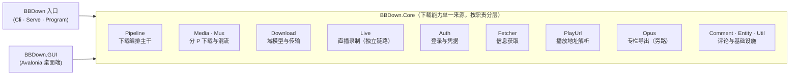

# BBDown 架构说明

本文档描述 BBDown 的项目结构、模块职责、核心流程与技术设计，供二次开发、排错与贡献代码参考。所有描述均基于当前源码，涉及的具体类/文件以仓库实际为准。

---

## 1. 概览

BBDown 是一个基于 **.NET 9** 的哔哩哔哩视频下载 / 解析命令行工具，定位为单文件可执行体（`dotnet publish -p:PublishAot=true` 可产出 AOT 原生二进制）。整体被拆为三块：

- **`BBDown`**：入口可执行项目（SDK `Microsoft.NET.Sdk.Web`），负责命令行解析、serve 服务器模式与入口编排；下载能力全部在 `BBDown.Core`。
- **`BBDown.Core`**：核心类库（`IsAotCompatible=true`），负责下载编排、媒体下载、混流、直播、登录、解析、字幕、弹幕等全部可复用能力。
- **`BBDown.GUI`**：图形界面（Avalonia，`net9.0`），直接引用 `BBDown.Core` 下载库，以库调用方式执行下载（非子进程调用 `BBDown.exe`），AOT 单文件发布。

代码层面强制 **nullable enable**、**`TreatWarningsAsErrors=true`**、**集中式包版本管理**（`Directory.Packages.props`），并以 `System.Text.Json` **源生成器**（`JsonSerializerContext`）替代运行时反射，保证 AOT 裁剪安全。

三个项目的依赖方向如下（`BBDown.GUI` 与 `BBDown` 都只依赖 `BBDown.Core`，Core 不反向依赖入口项目）：



---

## 2. 项目结构

```
BBDown/
├── BBDown/                 # 入口可执行项目 (Sdk.Web, PackAsTool)，命名空间 BBDown
│   ├── Program.cs          # Main、子命令装配（login/serve）、全局取消、RunApp 入口编排（专栏/直播分流）
│   ├── ProgressBar.cs      # 控制台进度条渲染器（接收 ProgressSampler 采样回调）
│   │
│   ├── Cli/                # 命名空间 BBDown.Cli — 命令行解析
│   │   ├── CliOptions.cs           # 全部 CLI 选项与别名的静态定义（按 README 分组，注册顺序即 --help 顺序）
│   │   ├── CommandLineInvoker.cs   # GetRootCommand 装配与参数 → DownloadRequest 映射
│   │   └── ConfigParser.cs         # 配置文件解析 (仅补齐命令行未指定项)
│   │
│   └── Serve/              # 命名空间 BBDown.Serve — serve 模式
│       ├── BBDownApiServer.cs      # 分部类主干：SetUpServer / 令牌鉴权 / CORS / 并发限流（Run / RunAsync / StartForTestAsync）
│       ├── BBDownApiServer.Endpoints.cs # 分部类：Minimal API 路由（/add-task、/get-tasks/*、/stop-task/{id} 等）
│       ├── BBDownApiServer.Tasks.cs     # 分部类：任务表维护（DownloadTask / Queued → Running → Finished）
│       ├── DownloadTask.cs         # serve 任务状态/快照 record（DownloadStatus / DownloadTask / DownloadTaskSnapshot，Cts [JsonIgnore]）
│       ├── ServeConfig.cs          # serve 启动参数聚合 record（取代 StartServer 散参，服务端固定不可覆盖）
│       ├── ServeRequestOptions.cs  # serve 请求受控子集 + CallBackWebHook
│       ├── ServeBindingResult.cs   # 请求绑定结果（含非法字段回落语义）
│       ├── ApiTypeJsonConverter.cs # serve 契约 Api 字段字符串 ↔ ApiType 转换
│       ├── ServeRequestOptionsJsonContext.cs # serve 请求 DTO 源生成器上下文
│       ├── AppJsonSerializerContext.cs # serve 响应 DTO 源生成器上下文
│       └── SsrfGuard.cs            # SSRF 防护静态类（IsSafeWebHook / IsPrivateAddress / IsLoopbackUrl / WebHookClient）
│
├── BBDown.Core/            # 核心类库 (library, IsAotCompatible)，命名空间 BBDown.Core
│   ├── Download/           # 下载域模型与传输层（跨层共用，避免模型层反向引用能力层）
│   │   ├── DownloadRequest.cs     # 不可变运行时配置 record（含 WithSecretsRedacted）
│   │   ├── RunConfig.cs           # 进程级配置 record（WorkSetup.Build 产出）
│   │   ├── WorkContext.cs         # 工作上下文 record
│   │   ├── DownloadSession.cs     # 分 P 生命周期恒定入参 record
│   │   ├── PageContext.cs         # 分 P 上下文 record
│   │   ├── PageOutcome.cs         # 分 P 落盘结果 record（Media/Mux 共用，解除循环依赖）
│   │   ├── PipelineSink.cs        # 下载链路进度回吐回调（Meta / Saved / Sample，取代透传 serve 的 DownloadTask）
│   │   ├── ToolPaths.cs           # 外部工具路径不可变快照（ffmpeg / mp4box / aria2c）
│   │   ├── FetchResult.cs         # 信息获取结果 record
│   │   ├── ChargedPreviewException.cs # 充电专属试看中止异常
│   │   ├── ContentSelector.cs     # 下载内容标记 DownloadContent + -g/-w/-W 解析与规范化（get ∪ with − without）
│   │   ├── DanmakuFormat.cs       # 弹幕格式信息
│   │   ├── CommentFormat.cs       # 评论格式信息（与弹幕各自独立，解析逻辑不共用）
│   │   ├── MuxMode.cs             # 混流方式枚举（none / mpeg4 / mp4box / mkv）
│   │   ├── LiveQuality.cs         # 直播清晰度档位枚举
│   │   ├── DownloadUtil.cs        # 唯一下载入口（续传、CDN 策略）
│   │   ├── DownloadConfig.cs      # 下载配置类（DownloadUtil 拆分出）
│   │   ├── PartDownloader.cs      # 分片续传执行层
│   │   ├── PartFile.cs            # 断点续传状态 (.bbdown.part/.bbdown.json)
│   │   ├── CdnHost.cs             # CDN host 策略
│   │   ├── BBDownAria2c.cs        # Aria2c 下载
│   │   ├── SavePath.cs            # 文件名/路径格式化（含充电试看 [试看] 前缀）
│   │   └── PostProcessClient.cs   # 外部后处理进程的文件交换协议（DASH 轨交外部处理）
│   │
│   ├── Pipeline/           # 命名空间 BBDown.Core.Pipeline — 下载编排主干（CLI 与 serve 共用）
│   │   ├── DownloadPipeline.cs     # RunAsync 三段下载主干
│   │   ├── WorkSetup.cs            # 进程级初始化 → RunConfig (Build / ResolveConfig / ResolveToolPaths)
│   │   ├── VideoInfo.cs            # FetchAsync 解析视频信息（标题/分P/封面/账号探测）
│   │   ├── PageQueue.cs            # 逐分 P 编排 (RunAsync；-iap 逐集交互确认走 PageSelect.ResolveInteractive)
│   │   ├── PageSelect.cs           # 分 P 选择/范围 + 逐集交互选择
│   │   ├── InputResolver.cs        # URL/编号 → 内部 avid 解析（含稍后再看 /watchlater/ 与分享链接 bvid/oid）
│   │   ├── LiveDownload.cs         # 直播录制编排 (RunAsync)：独立链路，不走 WorkContext
│   │   └── OpusDownload.cs         # 专栏导出入口 (RunAsync)：在 RunApp 内于 WorkSetup.Build 之前分流，不经混流
│   │
│   ├── Media/              # 命名空间 BBDown.Core.Media — 单分 P 下载与封装
│   │   ├── PageDownload.cs         # 单分 P 下载入口，分派 DASH/FLV (RunAsync / DispatchAsync)
│   │   ├── DashDownload.cs         # DASH 轨下载 (RunAsync；下载后调用外部后处理，见 TryPostProcessAsync)
│   │   ├── FlvDownload.cs          # FLV 分段下载与合并 (RunAsync)
│   │   ├── PageAssets.cs           # 封面/字幕准备、弹幕下载（`PrepareAsync` 现收窄接收 `DownloadSession`）
│   │   ├── CommentDownload.cs      # 评论区导出（按 --comment-formats 落盘 json/txt，挂 PageQueue）
│   │   └── TrackSelect.cs          # 轨道排序、信息打印、交互选轨
│   │
│   ├── Mux/                # 命名空间 BBDown.Core.Mux — 混流与收尾
│   │   ├── MuxFinish.cs            # 混流收尾、跳过已存在、清理临时文件 (DASH/FLV 共用)
│   │   ├── Muxer.cs                # FFmpeg/MP4Box 混流、FLV 合并（混流入参统一为不可变 `MuxRequest` record）
│   │   └── ChapterMeta.cs          # 章节元数据
│   │
│   ├── Live/               # 命名空间 BBDown.Core.Live — 直播录制（独立链路，不依赖 WorkContext）
│   │   ├── LiveInputResolver.cs    # 直播间地址解析（live: / live.bilibili.com/{房间号}，短号换算）
│   │   ├── LiveFetcher.cs          # 拉流地址获取（http_stream + flv；带加密标记的流跳过）
│   │   ├── LiveRoomInfo.cs         # 房间信息 + 清晰度档位 LiveQuality
│   │   ├── LiveRecorder.cs         # 录制状态机（断流退避重连 / CDN failover / 编码锁定）
│   │   ├── LiveSegmentWriter.cs    # 单段 FLV 落盘
│   │   ├── LiveProgress.cs         # 录制进度回吐
│   │   ├── LiveFileNaming.cs       # 分段/产物文件名（主播名-标题-时间戳）
│   │   ├── LiveMuxer.cs            # 分段 FLV → mp4 合并（avc/hevc bitstream filter 分派、+genpts）
│   │   └── LiveSignal.cs           # Ctrl+Break 停录合并 / Ctrl+C 中断信号
│   │
│   ├── Auth/               # 命名空间 BBDown.Core.Auth — 登录与凭据
│   │   ├── Login.cs                # 扫码登录公共轮询编排（QrLoginPlan / RunQrLoginAsync，接入全局取消与失败重试）
│   │   ├── Login.Web.cs            # WEB 登录（BuildWebCookieResilient 多源合并 Cookie + 登录后账号名校验）
│   │   ├── Login.App.cs            # TV / APP 登录（LoginWithAppKey，各自 appkey/secret）
│   │   ├── Login.Refresh.cs        # refresh_token 主动续期（RSA-OAEP 加密请求）
│   │   ├── Login.Sign.cs           # TV/APP 登录签名（appkey sign / 时间戳 / 随机串）
│   │   ├── Account.cs              # 账号探测
│   │   ├── AccountInfo.cs          # 账号信息
│   │   └── CredentialStore.cs      # 单一 JSON 凭据读写 (源生成器 AOT 安全)
│   │
│   ├── Fetcher/            # 命名空间 BBDown.Core.Fetcher — 信息获取
│   │   ├── NormalInfoFetcher.cs    # 普通视频信息（wbi/view）
│   │   ├── BangumiInfoFetcher.cs   # 番剧信息（pgc/view）
│   │   ├── IntlBangumiInfoFetcher.cs # 国际版番剧信息
│   │   ├── CheeseInfoFetcher.cs    # 课程信息（过滤锁定分集）
│   │   ├── FavListFetcher.cs       # 收藏夹
│   │   ├── MediaListFetcher.cs     # 合集
│   │   ├── SpaceListFetcher.cs     # UP 主空间投稿列表
│   │   ├── WatchLaterFetcher.cs    # 稍后再看
│   │   ├── FetcherRegistry.cs      # 按 ResourceId 子类型 switch 分发（缺分支编译报错）
│   │   └── BangumiNotFoundException.cs # 番剧未找到异常
│   │
│   ├── PlayUrl/            # 命名空间 BBDown.Core.PlayUrl — 播放地址解析
│   │   ├── PlayUrlRequest.cs       # 顶层 internal record struct（aidOri/aid/cid/epId 与 API 模式）
│   │   ├── PlayUrlClient.cs        # URL 构造 + 发送（WEB/TV/INTL/网页兜底）+ appkey 常量
│   │   ├── PlayUrlResponse.cs      # 响应形状导航（data/result/video_info 节点定位、大会员判定）
│   │   ├── DashTrackReader.cs      # 纯函数：DASH JSON → 视频/音频轨（免二压两次响应并集、杜比/Hi-Res 回退）
│   │   ├── FlvTrackReader.cs       # 纯函数：FLV 分段 → 轨道
│   │   ├── IntlTrackReader.cs      # 纯函数：INTL(BiliPlus) video_info → 轨道
│   │   ├── AppTrackReader.cs       # APP(gRPC) PlayViewReply → 轨道（FetchAsync 含 gRPC 调用）
│   │   └── TrackFactory.cs         # 跨端共享：baseUrl 选择 / codec 名 / Audio 构建
│   │
│   ├── Opus/               # 命名空间 BBDown.Core.Opus — 专栏导出
│   │   ├── OpusInputResolver.cs    # 专栏地址解析
│   │   ├── OpusFetcher.cs          # 网络编排与判定（partial，含 OpusFetcher.Parse.cs / OpusFetcher.Paragraph.cs）
│   │   ├── OpusHtmlToMarkdown.cs   # HTML → Markdown 转换
│   │   ├── OpusMarkdownRenderer.cs # Markdown 渲染（YAML front matter 等）
│   │   ├── OpusImageUtil.cs        # 图片下载与协议归一
│   │   ├── OpusRegexes.cs          # [GeneratedRegex] 集中声明
│   │   └── OpusDocument.cs         # 域模型
│   │
│   ├── Comment/            # 命名空间 BBDown.Core.Comment — 评论区
│   │   ├── CommentFetcher.cs       # WBI 分页抓取
│   │   ├── CommentRenderer.cs      # JSON / TXT 渲染
│   │   └── CommentDocument.cs      # 评论域模型
│   │
│   ├── Entity/             # VInfo / Page / Video / Audio / ParsedResult 等
│   ├── Util/               # BV 转换、FileNameUtil(200 字节截断)、HTTPUtil、SignUtil(WBI)、SubUtil、GrpcUtil(gRPC 帧)、DanmakuUtil(弹幕 xml/ass)、ProgressSampler(进度采样)、ArchiveLog、Redactor、JsonUtil、Utils、ViewPointUtil
│   ├── APP/                # APP gRPC 协议 (proto 生成代码)
│   ├── Parser.cs           # 播放地址解析入口：编排 ExtractTracksAsync + 番剧分段点映射（请求构造/发送、响应导航、轨道读取已下沉到 PlayUrl/）
│   ├── ResourceId.cs       # 判别联合（Av / Ep / Season / CheeseEp / CheeseSeason / Fav / MediaList / Series / Space / WatchLater）
│   ├── ResourceIdJsonConverter.cs # ResourceId JSON 序列化
│   ├── AppEnv.cs           # 进程级环境：AppDir / CancellationToken / Cancel()
│   ├── AppConfig.cs        # 请求级配置（cookie / token / host 三兄弟 / UA）
│   ├── AppHelper.cs        # APP gRPC 请求构造（设备指纹 / 请求头 / PlayView 载荷）
│   ├── BiliApi.cs          # 各接口 Host/Path 常量
│   ├── ApiType.cs          # API 通道枚举（web / tv / app / intl）
│   ├── Buvid.cs            # buvid3/4 获取
│   ├── Config.cs           # 清晰度档位 (Qualities/MaxQn/DolbyVisionQn) + 调试日志开关
│   ├── IdPrefix.cs         # 输入编号前缀常量 (ep:/ss:/lists:/series:/fav:/cheese:/spaceMid:/watchLater: 等)
│   ├── Interaction.cs      # 交互式提问（AskLine / AskIndex，读控制台）
│   ├── Logger.cs           # 日志（Output 可注入，GUI 等宿主替换输出目标）
│   └── DEPENDENCIES.md     # 依赖架构说明
│
├── BBDown.GUI/             # 图形界面（Avalonia，net9.0，AOT 单文件）
│   ├── App.axaml.cs        # Application 入口
│   ├── MainWindow.axaml    # 主窗口布局（任务列表 / 日志区 / 选项面板）
│   ├── MainWindow.axaml.cs # 主窗口：初始化、队列执行与直播/专栏分流
│   ├── MainWindow.Options.cs # 选项面板与下载参数的双向绑定
│   ├── MainWindow.Tasks.cs # 任务列表交互（取消 / 停止录制 / 重试 / 移除）
│   ├── MainWindow.Log.cs   # 日志区（ListBox 虚拟化 + 导出）
│   ├── MainWindow.Login.cs # 扫码登录入口与登录态展示
│   ├── LoginWindow.axaml(.cs) # 扫码登录弹窗（WEB / TV / APP）
│   ├── QueueRunner.cs      # 任务队列与并发池（1–8，运行中可调）
│   ├── TaskParams.cs       # 单任务参数模型 + DownloadRequest 映射
│   ├── UrlDetector.cs      # 下载目标识别
│   ├── ConfigStore.cs      # 面板选项便携保存（BBDown.GUI.config.json）
│   ├── StatusConverters.cs # 状态 → 颜色 / 可见性转换器
│   └── Theme.axaml         # 样式集中定义
│
├── BBDown.Tests/           # 针对 BBDown 的 xUnit 测试
├── BBDown.Core.Tests/      # 针对 BBDown.Core 的 xUnit 测试
└── Plugins/                # 插件（BBDown.Sample 内置模板；其余为独立 git 仓库，不进主构建）
    └── BBDown.Sample/      # 外部后处理协议示例插件与模板（见第 9 节）
```

**依赖方向**：`BBDown` → `BBDown.Core`；两个测试项目分别依赖对应实现。Core 不反向依赖入口项目，保证核心逻辑可独立测试。`BBDown.GUI` 只依赖 `BBDown.Core`，不引用 CLI 项目，其测试由独立 CI（`gui.yml`）覆盖构建。`Plugins/BBDown.Sample` 引用 `BBDown.Core`（协议 record 对齐），以独立进程被主程序按需调起，不在主构建链路上；其余插件为独立仓库。

**入口项目职责**：`BBDown` 主项目只保留命令行解析（`Cli`）、serve 服务器（`Serve`）与入口编排（`Program`：login/serve 子命令装配、专栏/直播分流、异常→退出码映射）。下载链路全部在 `BBDown.Core`，`Program.RunApp` 仅做三条链路的分流后调用 Core 的 `OpusDownload` / `LiveDownload` / `DownloadPipeline`。子命名空间之间的引用一律显式 `using`；`Serve` 引用 `Pipeline` 与 `Auth`，**反向不成立**——下载链路只通过根层的 `PipelineSink` 回调回吐进度，不认识 `BBDown.Serve.DownloadTask`（由 `just check-deps` 守护）。

---

## 3. 请求生命周期

一次下载从输入到落盘的主干流程：

```
用户输入
  │
  ▼
InputResolver.ResolveIdAsync      URL/av/BV/ep/ss/md/合集/系列/收藏夹/空间/稍后再看/b23.tv → ResourceId
  │  md{数字} 详情页 → pgc/review/user 映射出 season_id → 解析为 Season(season_id)（整季形态）
  │  ss{数字} 季号 → pgc/view/web/season 取 season_id → 同样解析为 Season(season_id)（整季形态，与 md 对称）
  │  /watchlater/ 系列地址 → WatchLater（分享链接带 bvid/oid 时只取单个视频）
  │
  ▼
FetcherRegistry.FetchAsync     按 ResourceId 子类型 switch 分发给对应 Fetcher → VInfo(分P列表/标题/封面…)
  │  (Ep 先番剧后回退 cheese；番剧可按 --api intl 走 IntlBangumiInfoFetcher；WatchLater 走 WatchLaterFetcher)
  ▼
Parser.ExtractTracksAsync (编排，按 API 模式委派到 PlayUrl/*) → ParsedResult(视频轨/音频轨/FLV 分段/字幕/弹幕入口)
  │  WEB: WBI 签名(UGC)；TV: access_token；APP: gRPC + identify_v1；INTL: protobuf/json
  ▼
DownloadPipeline.RunAsync (BBDown.Core.Pipeline，三段下载主干，CLI 与 serve 共用)
  │  ① WorkSetup.Build      → RunConfig (进程级初始化、工具路径探测、优先级解析)
  │  ② VideoInfo.FetchAsync → WorkContext (标题/分P/封面/弹幕入口)
  │  ③ PageQueue.RunAsync   → 逐分 P 编排（-iap 时先 PageSelect.ResolveInteractive 逐集交互确认；
  │                            --comments-count>0 时逐分 P 委托内先跑 CommentDownload，按 aid 去重；与视频下载互不干扰）
  │     └─ CommentDownload.RunAsync (WBI 分页抓评论 → 按 --comment-formats 落盘 json/txt)
  ▼
PageDownload.RunAsync / DispatchAsync   (单分 P：封面/字幕准备 → 分派 DASH/FLV)
  │  ├─ DashDownload.RunAsync   / FlvDownload.RunAsync
  │  │    └─ 下载完成后调用外部后处理（PostProcessClient.TryProcessAsync：调起 --post-process 指定进程，
  │  │       对所有 DASH 轨统一处理，是否加密由处理方判断；成功产物覆盖原轨参与混流，
  │  │       未配置 / 失败 / 超时一律静默保留原文件)
  │  ├─ DownloadUtil.DownloadAsync (续传写入 .bbdown.part)
  │  ├─ SubUtil / DanmakuUtil (字幕/弹幕)
  │  └─ MuxFinish.RunAsync (FFmpeg/MP4Box 混流 + 嵌入元数据/章节/字幕) — 统一 DASH/FLV 收尾
  ▼
落盘 (SavePath 经 FileNameUtil 截断) + 写入 BBDown.archives (--save-records)
```

**直播录制分支**：当输入命中 `LiveInputResolver.TryParse`（`live:` / `live.bilibili.com/{数字}` / `m.live.bilibili.com`），`RunApp` 在 `WorkSetup.Build` 之前分流到 `LiveDownload.RunAsync`，这是一条不经 `WorkContext` / 混流主干的独立链路：

```
用户输入（直播间地址）
  │
  ▼
LiveInputResolver.TryParse    live: / live.bilibili.com/{房间号} → 真实房间号（短号换算）
  │
  ▼
LiveFetcher.FetchAsync        取 http_stream + flv 流地址、房间信息与清晰度档位（带加密标记的流跳过）
  │
  ▼
LiveRecorder.RunAsync         分段落盘（断流退避重连 / CDN failover / 首段成功后编码锁定）
  │  ├─ LiveSegmentWriter      单段 FLV 写入 <dest>.<NNN>.bbdown.part
  │  └─ LiveProgress           进度回吐
  ▼
LiveMuxer.MergeSegmentsAsync  Ctrl+Break 触发：分段 FLV → 单个 mp4（avc→h264_mp4toannexb / hevc→hevc_mp4toannexb，+genpts）；Ctrl+C 中断保留分段、不合并
  ▼
落盘 <主播名>-<标题>-<yyyyMMdd_HHmmss>.mp4
```

**取消令牌贯穿全链路**：全局 `CancellationTokenSource`，Ctrl+C 触发优雅取消，`OperationCanceledException` 被捕获后进程以 `130` 退出，已下载的 `.bbdown.part` 临时文件保留，重跑同一条命令即可续传。直播录制同样接入该令牌：`LiveSignal` 区分 `Ctrl+Break`（停录并合并，退出码 `0`）与 `Ctrl+C`（中断保留分段，退出码 `130`）。

---

## 4. 四种 API 解析模式

API 通道由 `--api web|tv|app|intl` **单选**（默认 `web`，忽略大小写，非法值命令行报错退出）；仅在特定输入下自动回退 `web`（番剧 / 课程在 `tv` / `intl` 不可用、cheese 的 `intl` 等，见 `VideoInfo.NormalizeOptionsAfterFetch`）。各模式差异：

| 维度       | WEB                        | TV                     | APP                                  | INTL                |
| ---------- | -------------------------- | ---------------------- | ------------------------------------ | ------------------- |
| 目标 Host  | `api.bilibili.com`         | `api.snm0516.aisee.tv` | `api.bilibili.tv` (gRPC)             | `api.biliintl.com`  |
| 鉴权       | Cookie (`SESSDATA` 等)     | `access_token`         | `authorization: identify_v1 {Token}` | `access_token`      |
| 传输       | JSON                       | JSON                   | 手写 gRPC 帧 (`AppHelper` 打包/解包) | protobuf/json       |
| WBI 签名   | 仅 UGC playurl / view / v2 | 否                     | 否                                   | 否                  |
| 清晰度限制 | 有 res/fps                 | 无 res/fps             | 番剧仅 HEVC；码率为估算              | 由 stream_list 决定 |
| 典型用途   | 普通视频、大会员网页内容   | 番剧/大会员 TV 接口    | 番剧 APP 接口                        | 东南亚国际版视频    |

关键细节：

- **WBI 签名**：仅对 **UGC** 的 playurl、`wbi/view`、`wbi/v2` 使用；当未探测到账号（`Wbi` 为空）时，所有 WBI 接口退化为不签名。番剧 / 课程的 playurl **不做 WBI 签名**。
- **APP 端 gRPC**：非 `Grpc.Net` 客户端，而是手写 HTTP POST + gzip 帧（`AppHelper.PackMessage` / `ReadMessage`），鉴权靠 `identify_v1` 令牌头。
- **playurl 请求次数**：DASH 会先按用户 `-q` 请求一次，再额外以最高清晰度（`qn=127`）请求一次以取得「免二压 / 原始画质」视频轨（两次取并集）；**FLV 始终以 `qn=127` 请求，忽略 `-q`**。

---

## 5. serve 模式与鉴权

`BBDown serve` 用 ASP.NET Minimal API 暴露任务增删查接口（完整契约见 [API.md](./API.md)）。实现为 `BBDownApiServer` 分部类（`BBDownApiServer.cs` 主干 / `BBDownApiServer.Endpoints.cs` 端点注册 / `BBDownApiServer.Tasks.cs` 任务表维护），SSRF 防护抽到独立静态类 `SsrfGuard`，启动参数聚合为 `ServeConfig` record。设计要点：

- **令牌鉴权**：`SetUpServer` → `FinalizeAuth(url)` 判定监听地址：
    - 绑定**回环地址**（默认 `127.0.0.1`）→ 免令牌。
    - 绑定**非回环地址**（如 `0.0.0.0`）且未显式 `--serve-token` → 自动生成令牌并打印，客户端必须携带 `X-BBDown-Token` 请求头或 `?token=` 查询参数，否则返回 `401`。
- **请求契约收窄**：`ServeRequestOptions` 是 `DownloadRequest` 的受控子集，刻意剔除主机可控字段（`FFmpegPath`/`Mp4boxPath`/`Aria2cPath`/`Aria2cArgs`/`WorkDir`/`FilePattern`/`MultiFilePattern`/`Host`/`EpHost`/`TvHost`/`Debug`/`UserAgent`/`ConfigFile`）与交互式选项（`InteractiveQuality`/`InteractivePages`——serve 无本地 stdin，交互选项从契约移除），这些一律以服务端启动配置为准（`ServeConfig`），即便请求传入也会被忽略。
- **SSRF 防护**（`SsrfGuard`）：任务完成后的 `CallBackWebHook` 回调用 `IsSafeWebHook` / `IsPrivateAddress` 校验，拒绝内网 / 回环地址，仅允许公网可达端点；专用 `WebHookClient` 关闭自动重定向并在连接前二次校验端点 IP。
- **CORS**：默认**完全关闭**（不发送 `Access-Control-Allow-Origin` 头），从根本上消除恶意网页经浏览器发起的 CSRF 面；仅当显式 `--cors-origin <url>` 时才对该单一来源开放（用于同源之外的 Web 前端），且公网暴露仍需配合反向代理与 TLS。
- **容量上限**：已完成任务保留上限 `MaxFinishedTasks = 200`，超出按策略淘汰。
- **任务表以 `ResourceId` 为键**（`ConcurrentDictionary<ResourceId, DownloadTask>`）：解析结果直接作键，值相等性天然去重，同资源重复提交命中同一任务；`DownloadTask.Id` 即该 `ResourceId`，JSON 序列化为规范字符串（如 `season2539`，与路径参数同一编码，见 [API.md](./API.md) 的任务标识一节）。
- **并发限流**：`--max-concurrent N`（默认 `0` = 不限制，保持历史行为）。`SetUpServer` 在 `N > 0` 时建立 `SemaphoreSlim(N, N)`；`AddDownloadTaskAsync` 经 `RunGatedAsync` 在调用 `DownloadPipeline.RunAsync` 前取额度、`finally` 归还。取额度发生在 id 去重登记**之后**，因此排队中的任务已在 `runningTasks` 里可见，`DownloadTask.Status` 为 `Queued`，拿到额度转 `Running`，收尾转 `Finished`。`max-concurrent` 仅约束**同时下载的任务数**，多余任务排队；单个任务内部的下载并行度（分片并发）由多线程下载器自行决定（`PageDownload.BuildDownloadConfig` 始终将 `MaxDegreeOfParallelism` 设为 `0`，即回落到 `ProcessorCount`），不再随限流被压到 `1`。`0` 表示不限制（与 CLI 完全一致）。

> 注意：`/remove-finished*` 与 `/add-task` 均为 **POST**；查询类（`/get-tasks/*`）为 GET。
>
> **单任务取消**：每个 `DownloadTask` 持有与进程级 `AppEnv.CancellationToken`（关停源）`Link` 的 `CancellationTokenSource Cts`；`POST /stop-task/{id}` 调用 `task.Cts.Cancel()` 取消单个运行/排队中的任务，不影响其他任务。Ctrl+C 取消全局令牌会经链接源取消所有任务。`Cts` 标记 `[JsonIgnore]`，不进入任务 DTO 的序列化。

---

## 6. 断点续传

续传由 `PartFile` + `PartManifest` 实现：

- 每条流先写入 `<目标路径>.bbdown.part` 数据文件，并维护 `<目标路径>.bbdown.json` 清单（记录 URL 指纹、各分片已完成字节、服务器校验器）。
- 清单以目标路径的 **SHA256 前 16 位**作为指纹（`PartFile.Fingerprint`），用于识别「同一资源」避免错续。
- 分片大小 `DefaultChunkSize = 20MB`，支持分片并发写入；失败时临时文件保留。
- **重跑同一条命令即可从断点继续**，粒度覆盖：单条流（视频轨下完、音频轨失败 → 只补音频轨）与合集 / 多 P（某分 P 失败仅补该分 P）。所有分片（含边下边混流的临时文件）都成功后才清理临时文件。
- CDN 策略：CMCC 等特殊 CDN 强制单线程；`ReplaceUrl` 默认把 https→http（mcdn 域跳过）。

---

## 7. 凭据与安全模型

### 7.1 单一凭据文件 `BBDown.data`

WEB / TV / APP 三类凭据合并进**同一个 JSON 对象**（字段：`cookie` / `refresh_token` / `ts` / `tv_access_token` / `tv_ts` / `app_access_token` / `app_ts`），未登录字段为 `null`。由 `CredentialStore` 用 `System.Text.Json` **源生成器**（`CredentialJsonContext`）序列化，规避 AOT 裁剪。每次保存只更新对应字段并合并保留其余字段（登录 TV/APP 不会冲掉 WEB Cookie）。类 Unix 系统下文件权限收紧为 `600`。

### 7.2 Web Cookie 续期

`Login.TryRefreshWebCookieIfStaleAsync` 在下载前 best-effort 检测 Cookie 是否过旧，用 `refresh_token` 经 **RSA-OAEP** 加密请求续期，刷新 `cookie` 与 `refresh_token` 并回写；续期失败不影响正常下载（回退到已有 Cookie）。续期进程内仅触发一次。

### 7.3 传输与接口安全

- **TLS 逃生舱**：`BBDOWN_INSECURE_TLS=1` 用于关闭证书校验（无常规代理配置项，HTTPUtil 不读取系统代理）。
- **SSRF**：仅 `CallBackWebHook` 回调做内网 / 回环地址校验（`SsrfGuard`，见第 5 节）。
- **serve 令牌**：见第 5 节。
- **设备标识**：`buvid3` / `buvid4` 纯远端获取，失败时不本地伪造设备标识。

---

## 8. 字幕 / 弹幕 / 评论 / 文件名

- **字幕 (`SubUtil`)**：已登录账号可走 WEB/TV；**未登录时只能走 APP gRPC** 获取字幕。AI 字幕默认不下载，需内容集含 `S`（`-w S`）显式开启。
- **弹幕 (`DanmakuUtil`)**：支持 XML / ASS 两种格式（`--danmaku-formats`），ASS 参数全部硬编码不可配，无去重 / 过滤。
- **评论 (`CommentFetcher` / `CommentRenderer` / `CommentDownload`)**：走 `/x/v2/reply/wbi/main`（WBI 签名 + 游标分页）。`--comments-count` / `-cn` 默认 `0`（不下载，且需内容集含 `o` / `O` 才真正抓取），`--comments-sort` / `-cs` 选 `hot`/`time`，`--comments-formats` / `-cf` 选 `json`/`txt`（`CommentFormat` 与弹幕格式**两个互不相干的特性，解析逻辑各自独立**）。评论区按 **aid** 绑定、与 cid / 分 P 无关，挂在 `PageQueue.RunAsync` 逐分 P 委托里用局部 `HashSet` 按 aid 去重，**DASH 与 FLV 两条路径都覆盖**；多 P 同 aid 只抓一次。默认只保留一级评论内联的最多 3 条楼中楼预览，内容集含 `O`（`-g O`）才额外翻页抓全。抓取失败一律降级为「拿到多少算多少」，只有 WBI 签名错误（`-403`）才抛异常——评论下载与视频下载互不干扰。
- **文件名 (`FileNameUtil`)**：按 **UTF-8 字节数截断，上限 200 字节**（约 66 个汉字），避免过长路径；变量支持自定义日期格式 `<publishDate:yyyyMMdd>` / `<videoDate:格式>`。

---

## 9. 外部后处理（--post-process）

playurl 对部分版权内容下发加密轨道（密文为 CENC cbcs 一类）。主程序**不内置任何解密能力，也不解析任何加密特征**：下载完成后把所有 DASH 轨统一交由 `--post-process` 指定的外部进程处理；是否加密、密钥、通道与加密信息均由外部进程自行获取判断，主程序不感知。

- **调起**（`BBDown.Core/Download/PostProcessClient.cs`：`TryProcessAsync` / `Configure`）：`--post-process <exe>` 由 `CommandLineInvoker` 经 `PostProcessClient.Configure` 注册；对每条 DASH 轨写请求 JSON（`PostProcessRequest`：`Aid` / `Cid` / `Kind` / `TrackPath` / `DestPath` / `Ffmpeg`），以请求文件路径为唯一参数调起外部进程，20 秒超时。请求只携带轨道定位与本地路径，**不携带任何加密特征与凭据**。
- **接入点与降级**（`BBDown.Core/Media/DashDownload.cs`：`TryPostProcessAsync`）：DASH 轨下载完成后对视频轨 / 音频轨 / 背景音 / 配音轨统一处理——进程退出码为 0 且产物非空时，产物覆盖原轨参与混流；退出码 0 且无产物视为无需处理；未配置 `--post-process` / 进程不可用 / 超时 / 失败，一律静默保留原文件，原文件照常参与混流。FLV 分支与直播录制不经此路径（直播对带加密标记的流直接跳过，见 `LiveFetcher`）。
- **示例插件**：`Plugins/BBDown.Sample`（主仓库内置）即协议的最小实现与模板，演示请求字段访问与「无需处理」语义（构建与使用见其 [README](./Plugins/BBDown.Sample/README.md)）；文件交换协议见 [PROTOCOL.md](./PROTOCOL.md)。

---

## 10. 构建与 AOT

- SDK：`Microsoft.NET.Sdk.Web`（`BBDown`）、`Microsoft.NET.Sdk`（`BBDown.Core` / 测试）、`Microsoft.NET.Sdk`（`BBDown.GUI`，Avalonia，`net9.0`）。
- `BBDown.Core` 标记 `IsAotCompatible=true`；序列化一律用 `JsonSerializerContext` 源生成器（`CredentialJsonContext` / `DownloadRequestJsonContext` / `PartJsonContext` / `PostProcessJsonContext` / `AppJsonSerializerContext` / `ServeRequestOptionsJsonContext`），禁止运行时反射。
- 全局 `TreatWarningsAsErrors=true`、`Nullable enable`、`LangVersion latest`、集中式包版本（`Directory.Packages.props`）。
- 发布 AOT：`dotnet publish -c Release -r <RID> /p:PublishAot=true`。注意 AOT 下 `BBDown.data` 等 JSON 必须走源生成器，否则会被裁剪导致反序列化失败。
- **图形界面发布**（`BBDown.GUI`）：`PublishAot` + `PublishSingleFile`，由独立 CI（`.github/workflows/gui.yml`）在 Windows / macOS / Linux（各 x64 / arm64，Linux 仅 glibc）上发布自包含单文件，并将整个发布目录打包为 zip 上传产物，可手动触发追加到最新 Release；主 CI（`ci.yml`）不构建 GUI。
- **Win7 兼容构建**（CLI，`win-x64`）：`-p:WindowsWin7Compat=true` 接入 YY-Thunks 与 VC-LTL，产物可在 Windows 7 直接运行（需先装 KB3140245 提供 TLS 1.1/1.2）。

> 调试构建（`dotnet build -c Debug`）不受 AOT 限制，可正常用运行时反射；仅发布 AOT 时需遵守上述约束。

---

## 11. 专栏导出旁路

根命令识别到专栏地址（`https://www.bilibili.com/opus/...`、`cv{id}`、`opus{id}` 等）时，会把 B 站「专栏 / 图文」抓取并转换为 Markdown；纯图文动态（`item.type == 0`）同样按正文导出，不再误判为专栏。它与音视频下载链路**完全独立**，是一条旁路，目的是避免让专栏逻辑被 `WorkSetup.Build` 的 ffmpeg 探测、混流、`SavePath.Format`（硬编码 `.mp4`）等音视频专属步骤拖累。

### 11.1 分流点

分流发生在 `Program.RunApp` 顶部，**早于** `DownloadPipeline.RunAsync` 内的 `WorkSetup.Build`：

```
用户输入
  │
  ▼
OpusInputResolver.TryParse(input)   opus URL / cv 号 / opus id / 前缀写法 → OpusTarget(OpusId|CvId)
  │  （裸数字一律拒绝，留给视频链路 av 号简写）
  ▼
OpusDownload.RunAsync (BBDown.Core.Pipeline)  不走 WorkSetup.Build / 不构造 WorkContext / 不探测 ffmpeg
  │  ├─ CredentialStore.LoadAll   读取 WEB Cookie（专栏可能登录可见）
  │  ├─ Buvid.InitAsync           获取 buvid3/4（沿用既有 HTTP 栈）
  │  ├─ OpusFetcher.FetchAsync     先试 opus/detail（htmlNewStyle）→ 按 TryGetCvId 判定：
  │  │                             专栏 → 回退 article/view(cv)；纯图文动态（无 cv）→ 直接按 MODULE_TYPE_CONTENT 导出
  │  ├─ OpusFetcher.ParseTopAlbum  顶部相册（MODULE_TYPE_TOP → module_top.display.album.pics）置于正文最前
  │  ├─ OpusHtmlToMarkdown        把 B 站专栏结构化的段落 JSON 转成 Markdown 模型（旧版 HTML 白名单降级，产物标记 IsRawMarkdown）
  │  ├─ OpusMarkdownRenderer      渲染标题/front matter/图片/列表/代码/公式等
  │  └─ OpusImageUtil             默认下载图片到 <标题>/images/；内容集不含 i（-W i）则保留远程链接
  ▼
落盘 <标题>.md（UTF-8 无 BOM，保证 YAML front matter 可被解析）
```

### 11.2 与主干的关键差异

- **不经过 `WorkSetup.Build`**：专栏不需要 ffmpeg / 账号探测 / 分 P 编排，因此**没有 ffmpeg 也能跑**；也不会因缺 ffmpeg 而抛异常。
- **不构造 `WorkContext`**：复用了 `HTTPUtil` / `Buvid` / `CredentialStore` 等底层能力，但绕开了 `WorkContext` 这一音视频上下文。
- **不用 `SavePath.Format`**：输出文件名由 `FileNameUtil.GetValidFileName` 直接处理，按 `<标题>.md` 落盘，图片进 `<标题>/images/`，与音视频的 `.mp4` 命名体系解耦。
- **解析拆分**：`OpusFetcher` 为 partial class，拆为网络编排与判定（`OpusFetcher.cs`）/ 文档级解析（`OpusFetcher.Parse.cs`）/ 段落与节点解析（`OpusFetcher.Paragraph.cs`）三份，便于控制单文件行数。
- **复用的 HTTP 桩点**：`OpusFetcher` 通过替换 `HTTPUtil.AppHttpClient` 进行单测（`StubHttpMessageHandler` + 路由桩），与 `BBDown.Core.Tests` 中其他 HTTP 测试共用 `HttpStubCollectionDefinition` 串行集合，避免 HttpClient 静态字段竞争。
- **AOT 约束一致**：`OpusFetcher` 解析接口 JSON 一律用 `JsonDocument` / `GetProperty`，不依赖运行时反射，与全项目 AOT 策略一致。

### 11.3 serve 模式说明

v1 的 `serve` JSON API 仅面向音视频任务，**不支持**提交专栏导出任务（`/add-task` 的 `Url` 只识别 `av|bv|BV|ep|ss` 编号）。专栏导出目前仅通过 CLI 根命令自动识别进行。
