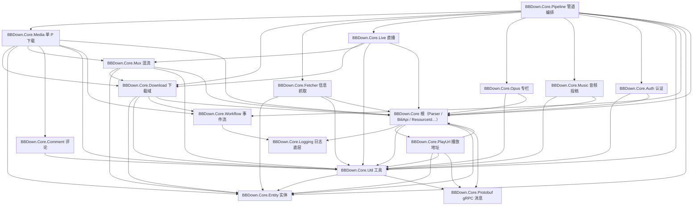

# BBDown.Core 依赖关系图

本文档描述 `BBDown.Core` 项目内全部命名空间、类及其依赖关系。箭头方向为 `A --> B`，表示 A 依赖 B（A 调用、构造或引用 B）。

## 命名空间清单

| 命名空间 | 职责 |
| ---------------------- | --------------------------------------------------- |
| `BBDown.Core` | 根命名空间：API 常量、全局配置、日志门面、资源 ID 判别联合、播放轨道解析 |
| `BBDown.Core.Auth` | 账号探测、登录（Web / TV / App）、凭据存取 |
| `BBDown.Core.Comment` | 评论抓取与渲染 |
| `BBDown.Core.Download` | 下载域数据结构（请求 / 会话 / 上下文）与下载执行（内置 downloader / aria2c） |
| `BBDown.Core.Entity` | 视频信息实体（VInfo / Page / Video / Audio 等） |
| `BBDown.Core.Fetcher` | 视频信息抓取器与资源分发注册表 |
| `BBDown.Core.Live` | 直播信息抓取、录制、分段写入、合并 |
| `BBDown.Core.Logging` | 日志底层：消息总线、控制台宿主 |
| `BBDown.Core.Media` | 单分 P 下载编排：DASH / FLV 分支、轨道选择、附属产物 |
| `BBDown.Core.Music` | 音频投稿（AU）信息抓取 |
| `BBDown.Core.Mux` | 混流执行（FFmpeg / MP4Box）、章节元数据、收尾 |
| `BBDown.Core.Opus` | 专栏（opus / cv）解析与 Markdown 渲染 |
| `BBDown.Core.Pipeline` | 下载管道编排：输入解析、工作分发、各类下载入口 |
| `BBDown.Core.PlayUrl` | playurl 请求构造与各 API 通道的轨道读取 |
| `BBDown.Core.Protobuf` | proto 生成的 gRPC 消息类型 |
| `BBDown.Core.Util` | HTTP 传输、签名、JSON、字幕、弹幕等通用工具 |
| `BBDown.Core.Workflow` | 宿主事件流：消息 / 进度总线、交互问答 |

## 命名空间级依赖总览

## 类级依赖图

包含全部命名空间与类。同一文件内的嵌套类型 / record 参数合并到所属节点；`JsonSerializerContext` 派生类随其数据类型标注。

```mermaid
flowchart TB
    subgraph S_logging["Logging"]
        direction LR
        LogMessage["LogMessage + LogLevel"]
        MessageBus["MessageBus + ScopeLease"]
        ConsoleHost["ConsoleHost"]
    end

    subgraph S_protobuf["Protobuf（proto 生成）"]
        direction LR
        ProtobufMsg["PlayViewReq / PlayViewReply / DmViewReq / DmViewReply 等"]
    end

    subgraph S_entity["Entity"]
        direction LR
        VInfo["VInfo"]
        ParsedResult["ParsedResult"]
        PageEntity["Page"]
        ViewPoint["ViewPoint"]
        Video["Video"]
        AudioEntity["Audio"]
        Subtitle["Subtitle"]
        Clip["Clip"]
        AudioMaterial["AudioMaterial / AudioMaterialInfo"]
    end

    subgraph S_util["Util"]
        direction LR
        Utils["Utils"]
        HTTPUtil["HTTPUtil"]
        HttpTransfer["HttpTransfer"]
        BiliHeaders["BiliHeaders"]
        SignUtil["SignUtil"]
        GrpcUtil["GrpcUtil"]
        JsonUtil["JsonUtil"]
        SubUtil["SubUtil"]
        DanmakuUtil["DanmakuUtil + DanmakuItem 等"]
        FileNameUtil["FileNameUtil"]
        RetryUtil["RetryUtil"]
        Redactor["Redactor"]
        ArchiveLog["ArchiveLog"]
        ProgressSampler["ProgressSampler"]
        ViewPointUtil["ViewPointUtil"]
        BilibiliBvConverter["BilibiliBvConverter"]
    end

    subgraph S_workflow["Workflow"]
        direction LR
        ChannelWorkflowContext["ChannelWorkflowContext"]
        AskBus["AskBus + PendingAsk"]
        AskOption["AskOption / AskAnswer"]
        WorkflowEvent["WorkflowEvent + 5 个子事件"]
        ProgressBus["ProgressBus + ProgressState / ProgressStage"]
    end

    subgraph S_core["BBDown.Core 根"]
        direction LR
        BiliApi["BiliApi（API 常量）"]
        AppConfig["AppConfig"]
        AppEnv["AppEnv"]
        Config["Config"]
        IdPrefix["IdPrefix"]
        Logger["Logger"]
        ApiType["ApiType + ApiTypeUtil"]
        Buvid["Buvid"]
        AppHelper["AppHelper + JsonContext"]
        Parser["Parser"]
        ResourceId["ResourceId（Av / Ep / Season / CheeseEp / CheeseSeason / Fav / MediaList / Series / Space / WatchLater / LiveRoom / OpusArticle / ReadList / SpaceOpus / SpaceAudio / SpaceDynamic / Audio）"]
        ResourceIdJsonConverter["ResourceIdJsonConverter"]
    end

    subgraph S_auth["Auth"]
        direction LR
        Account["Account"]
        AccountInfo["AccountInfo"]
        Login["Login（partial：主 / App / Web / Refresh / Sign）"]
        CredentialStore["CredentialStore + Credential"]
    end

    subgraph S_comment["Comment"]
        direction LR
        CommentDocument["CommentDocument + CommentItem"]
        CommentFetcher["CommentFetcher"]
        CommentRenderer["CommentRenderer"]
    end

    subgraph S_music["Music"]
        direction LR
        AudioFetcher["AudioFetcher"]
        AudioInfo["AudioInfo / AudioPlayUrl"]
    end

    subgraph S_download["Download"]
        direction LR
        ContentSelector["ContentSelector + DownloadContent / ContentMode"]
        PageContext["PageContext"]
        PageOutcome["PageOutcome + TrackSelection"]
        DownloadConfig["DownloadConfig"]
        DownloadRequest["DownloadRequest + JsonContext"]
        DownloadSession["DownloadSession"]
        RunConfig["RunConfig"]
        WorkContext["WorkContext"]
        ToolPaths["ToolPaths"]
        FetchResult["FetchResult"]
        PipelineSink["PipelineSink"]
        MuxMode["MuxMode"]
        LiveQuality["LiveQuality"]
        DanmakuFormat["DanmakuFormat + DanmakuFormatInfo"]
        CommentFormat["CommentFormat + CommentFormatInfo"]
        CdnHost["CdnHost"]
        BBDownAria2c["BBDownAria2c"]
        DownloaderAdapter["DownloaderAdapter"]
        SavePath["SavePath"]
        DownloadUtil["DownloadUtil"]
        PostProcessClient["PostProcessClient"]
        WorkDirException["WorkDirException"]
        ChargedPreviewException["ChargedPreviewException"]
    end

    subgraph S_playurl["PlayUrl"]
        direction LR
        PlayUrlClient["PlayUrlClient"]
        PlayUrlRequest["PlayUrlRequest"]
        PlayUrlResponse["PlayUrlResponse"]
        TrackFactory["TrackFactory"]
        AppTrackReader["AppTrackReader"]
        DashTrackReader["DashTrackReader"]
        FlvTrackReader["FlvTrackReader"]
        IntlTrackReader["IntlTrackReader"]
    end

    subgraph S_fetcher["Fetcher"]
        direction LR
        FetcherRegistry["FetcherRegistry"]
        NormalInfoFetcher["NormalInfoFetcher"]
        BangumiInfoFetcher["BangumiInfoFetcher"]
        IntlBangumiInfoFetcher["IntlBangumiInfoFetcher"]
        CheeseInfoFetcher["CheeseInfoFetcher"]
        FavListFetcher["FavListFetcher"]
        SpaceListFetcher["SpaceListFetcher"]
        MediaListFetcher["MediaListFetcher"]
        WatchLaterFetcher["WatchLaterFetcher"]
        BangumiNotFoundException["BangumiNotFoundException"]
    end

    subgraph S_opus["Opus"]
        direction LR
        OpusDocument["OpusDocument + Paragraph / TextNode / Image / ListItem"]
        OpusFetcher["OpusFetcher（partial：主 / Parse / Paragraph）"]
        OpusInputResolver["OpusInputResolver"]
        OpusMarkdownRenderer["OpusMarkdownRenderer + OpusRenderOptions"]
        OpusRegexes["OpusRegexes"]
        OpusHtmlToMarkdown["OpusHtmlToMarkdown"]
        OpusImageUtil["OpusImageUtil"]
    end

    subgraph S_mux["Mux"]
        direction LR
        Muxer["Muxer + MuxRequest"]
        MuxArgs["MuxArgs"]
        MuxFinish["MuxFinish + MuxInputs"]
        ChapterMeta["ChapterMeta"]
    end

    subgraph S_live["Live"]
        direction LR
        LiveInputResolver["LiveInputResolver + LiveTarget"]
        LiveRoomInfo["LiveRoomInfo + LiveStreamCandidate / LivePlayInfo"]
        LiveFetcher["LiveFetcher"]
        LiveRecorder["LiveRecorder + LiveRecordResult / LiveStopReason"]
        LiveSegmentWriter["LiveSegmentWriter"]
        LiveMuxer["LiveMuxer"]
        LiveSignal["LiveSignal + LiveSignalScope"]
        LiveFileNaming["LiveFileNaming"]
    end

    subgraph S_media["Media"]
        direction LR
        PageDownload["PageDownload"]
        DashDownload["DashDownload"]
        FlvDownload["FlvDownload"]
        TrackSelect["TrackSelect"]
        PageAssets["PageAssets"]
        CommentDownload["CommentDownload"]
    end

    subgraph S_pipeline["Pipeline"]
        direction LR
        InputResolver["InputResolver（partial：主 / Dispatch）"]
        WorkerDispatcher["WorkerDispatcher"]
        DownloadPipeline["DownloadPipeline"]
        VideoInfo["VideoInfo"]
        PageQueue["PageQueue"]
        PageSelect["PageSelect"]
        WorkSetup["WorkSetup"]
        AudioDownload["AudioDownload"]
        OpusDownload["OpusDownload"]
        LiveDownload["LiveDownload"]
        ReadListDownload["ReadListDownload"]
        SpaceDynamicDownload["SpaceDynamicDownload"]
        SpaceDynamicFeed["SpaceDynamicFeed"]
        SpaceOpusDownload["SpaceOpusDownload"]
        SpaceAudioDownload["SpaceAudioDownload"]
    end

    %% Logging / Workflow 底层
    Logger --> MessageBus
    Logger --> Config
    AskBus --> MessageBus
    ProgressBus --> MessageBus
    ChannelWorkflowContext --> WorkflowEvent
    ChannelWorkflowContext --> AskOption

    %% Util 内部与对外
    HTTPUtil --> HttpTransfer
    HTTPUtil --> BiliHeaders
    HTTPUtil --> Redactor
    HttpTransfer --> BiliHeaders
    SubUtil --> GrpcUtil
    SubUtil --> ProtobufMsg
    SubUtil --> FileNameUtil
    SubUtil --> SignUtil
    SubUtil --> Subtitle
    ViewPointUtil --> ParsedResult
    ViewPointUtil --> ViewPoint
    PageEntity --> BilibiliBvConverter

    %% 根命名空间
    AppHelper --> GrpcUtil
    AppHelper --> ProtobufMsg
    AppHelper --> HTTPUtil
    Buvid --> HTTPUtil
    Parser --> AppTrackReader
    Parser --> PlayUrlClient
    Parser --> DashTrackReader
    Parser --> FlvTrackReader
    Parser --> IntlTrackReader
    Parser --> ParsedResult
    ResourceIdJsonConverter --> ResourceId

    %% Auth
    Account --> HTTPUtil
    Login --> CredentialStore
    Login --> Account
    Login --> Buvid
    Login --> HTTPUtil
    Login --> HttpTransfer
    Login --> BiliHeaders

    %% Comment
    CommentFetcher --> HTTPUtil
    CommentFetcher --> SignUtil
    CommentFetcher --> JsonUtil
    CommentFetcher --> CommentDocument
    CommentRenderer --> CommentDocument

    %% Music
    AudioFetcher --> HTTPUtil
    AudioFetcher --> AudioInfo

    %% Download
    DownloadUtil --> DownloaderAdapter
    DownloadUtil --> BBDownAria2c
    DownloaderAdapter --> ProgressBus
    DownloaderAdapter --> ProgressSampler
    DownloaderAdapter --> BiliHeaders
    DownloadConfig --> DownloaderAdapter
    DownloadSession --> PageContext
    DownloadSession --> WorkContext
    DownloadSession --> DownloadConfig
    DownloadSession --> PipelineSink
    WorkContext --> RunConfig
    WorkContext --> FetchResult
    FetchResult --> VInfo
    PageContext --> PageEntity
    PipelineSink --> VInfo
    CdnHost --> Video
    SavePath --> VInfo
    ContentSelector --> DownloadRequest

    %% PlayUrl
    PlayUrlClient --> PlayUrlResponse
    PlayUrlClient --> PlayUrlRequest
    PlayUrlClient --> HTTPUtil
    PlayUrlClient --> SignUtil
    AppTrackReader --> AppHelper
    AppTrackReader --> TrackFactory
    AppTrackReader --> ViewPointUtil
    AppTrackReader --> ProtobufMsg
    DashTrackReader --> TrackFactory
    FlvTrackReader --> TrackFactory
    IntlTrackReader --> TrackFactory
    TrackFactory --> Video
    TrackFactory --> AudioEntity

    %% Fetcher
    FetcherRegistry --> ResourceId
    FetcherRegistry --> NormalInfoFetcher
    FetcherRegistry --> BangumiInfoFetcher
    FetcherRegistry --> IntlBangumiInfoFetcher
    FetcherRegistry --> CheeseInfoFetcher
    FetcherRegistry --> FavListFetcher
    FetcherRegistry --> SpaceListFetcher
    FetcherRegistry --> MediaListFetcher
    FetcherRegistry --> WatchLaterFetcher
    FetcherRegistry --> BangumiNotFoundException
    FetcherRegistry --> VInfo
    NormalInfoFetcher --> VInfo
    NormalInfoFetcher --> HTTPUtil
    NormalInfoFetcher --> SignUtil
    BangumiInfoFetcher --> HTTPUtil
    BangumiInfoFetcher --> BangumiNotFoundException
    IntlBangumiInfoFetcher --> HTTPUtil
    CheeseInfoFetcher --> HTTPUtil
    FavListFetcher --> HTTPUtil
    FavListFetcher --> NormalInfoFetcher
    SpaceListFetcher --> HTTPUtil
    SpaceListFetcher --> SignUtil
    SpaceListFetcher --> NormalInfoFetcher
    MediaListFetcher --> HTTPUtil
    WatchLaterFetcher --> HTTPUtil
    WatchLaterFetcher --> NormalInfoFetcher

    %% Opus
    OpusFetcher --> OpusDocument
    OpusFetcher --> OpusRegexes
    OpusFetcher --> OpusHtmlToMarkdown
    OpusFetcher --> HTTPUtil
    OpusHtmlToMarkdown --> OpusRegexes
    OpusHtmlToMarkdown --> OpusImageUtil
    OpusMarkdownRenderer --> OpusDocument
    OpusMarkdownRenderer --> OpusImageUtil

    %% Mux
    MuxFinish --> Muxer
    MuxFinish --> PageOutcome
    Muxer --> MuxArgs
    Muxer --> ChapterMeta
    Muxer --> Utils
    ChapterMeta --> HTTPUtil
    ChapterMeta --> SignUtil
    MuxArgs --> MuxMode

    %% Live
    LiveFetcher --> HTTPUtil
    LiveFetcher --> LiveRoomInfo
    LiveRecorder --> LiveFileNaming
    LiveSegmentWriter --> HTTPUtil
    LiveMuxer --> ToolPaths
    LiveMuxer --> Utils
    LiveFileNaming --> FileNameUtil

    %% Media
    PageDownload --> DashDownload
    PageDownload --> FlvDownload
    PageDownload --> PageAssets
    PageDownload --> ChapterMeta
    PageDownload --> Parser
    PageDownload --> DownloadSession
    PageDownload --> RetryUtil
    PageDownload --> ChargedPreviewException
    DashDownload --> TrackSelect
    DashDownload --> SavePath
    DashDownload --> CdnHost
    DashDownload --> MuxFinish
    DashDownload --> ChapterMeta
    DashDownload --> PageAssets
    DashDownload --> DownloadUtil
    DashDownload --> PostProcessClient
    FlvDownload --> TrackSelect
    FlvDownload --> CdnHost
    FlvDownload --> SavePath
    FlvDownload --> Muxer
    FlvDownload --> MuxFinish
    FlvDownload --> DownloadUtil
    FlvDownload --> DownloaderAdapter
    PageAssets --> SubUtil
    PageAssets --> DanmakuUtil
    PageAssets --> MuxFinish
    PageAssets --> SavePath
    PageAssets --> RetryUtil
    CommentDownload --> CommentFetcher
    CommentDownload --> CommentRenderer
    CommentDownload --> SavePath
    CommentDownload --> MuxFinish
    TrackSelect --> AskBus
    TrackSelect --> ParsedResult

    %% Pipeline
    WorkerDispatcher --> ResourceId
    WorkerDispatcher --> LiveDownload
    WorkerDispatcher --> OpusDownload
    WorkerDispatcher --> ReadListDownload
    WorkerDispatcher --> SpaceOpusDownload
    WorkerDispatcher --> SpaceDynamicDownload
    WorkerDispatcher --> SpaceAudioDownload
    WorkerDispatcher --> AudioDownload
    WorkerDispatcher --> DownloadPipeline
    DownloadPipeline --> WorkSetup
    DownloadPipeline --> VideoInfo
    DownloadPipeline --> PageQueue
    DownloadPipeline --> ChannelWorkflowContext
    VideoInfo --> Account
    VideoInfo --> Login
    VideoInfo --> Buvid
    VideoInfo --> InputResolver
    VideoInfo --> FetcherRegistry
    VideoInfo --> FetchResult
    PageQueue --> PageSelect
    PageQueue --> PageDownload
    PageQueue --> CommentDownload
    PageQueue --> SavePath
    PageQueue --> WorkContext
    PageQueue --> ArchiveLog
    PageQueue --> RetryUtil
    PageQueue --> ChargedPreviewException
    WorkSetup --> CredentialStore
    WorkSetup --> ToolPaths
    WorkSetup --> RunConfig
    WorkSetup --> WorkDirException
    InputResolver --> ResourceId
    InputResolver --> BilibiliBvConverter
    InputResolver --> LiveInputResolver
    InputResolver --> OpusInputResolver
    InputResolver --> HTTPUtil
    AudioDownload --> AudioFetcher
    AudioDownload --> DownloadUtil
    AudioDownload --> ProgressBus
    AudioDownload --> FileNameUtil
    AudioDownload --> WorkSetup
    AudioDownload --> VInfo
    OpusDownload --> OpusFetcher
    OpusDownload --> OpusInputResolver
    OpusDownload --> OpusMarkdownRenderer
    OpusDownload --> OpusImageUtil
    OpusDownload --> DownloadUtil
    OpusDownload --> FileNameUtil
    OpusDownload --> WorkSetup
    OpusDownload --> HTTPUtil
    OpusDownload --> VInfo
    LiveDownload --> LiveFetcher
    LiveDownload --> LiveRecorder
    LiveDownload --> LiveSegmentWriter
    LiveDownload --> LiveMuxer
    LiveDownload --> LiveSignal
    LiveDownload --> LiveFileNaming
    LiveDownload --> LiveQuality
    LiveDownload --> ProgressBus
    LiveDownload --> ProgressSampler
    LiveDownload --> WorkSetup
    ReadListDownload --> OpusDownload
    ReadListDownload --> WorkSetup
    ReadListDownload --> HTTPUtil
    ReadListDownload --> JsonUtil
    ReadListDownload --> FileNameUtil
    SpaceDynamicDownload --> SpaceDynamicFeed
    SpaceDynamicDownload --> DownloadPipeline
    SpaceDynamicDownload --> OpusDownload
    SpaceDynamicDownload --> FileNameUtil
    SpaceDynamicFeed --> HTTPUtil
    SpaceDynamicFeed --> SignUtil
    SpaceOpusDownload --> SpaceDynamicFeed
    SpaceOpusDownload --> OpusDownload
    SpaceOpusDownload --> FileNameUtil
    SpaceAudioDownload --> AudioDownload
    SpaceAudioDownload --> HTTPUtil
    SpaceAudioDownload --> FileNameUtil
    PageSelect --> AskBus
```

## 横切依赖说明

以下基础类型被大量类引用，为保持图面可读未逐一画边：

- `Logger`：几乎所有编排 / 下载 / 抓取类的日志输出入口。
- `Config`：进程级配置（画质 / 音质 / 调试日志等），被 `Parser`、`Muxer`、`LiveMuxer`、`PageDownload` 等读取。
- `BiliApi`：API 地址常量，被所有 Fetcher、`Parser`、`SubUtil`、`ChapterMeta`、`SpaceDynamicFeed`、`ReadListDownload` 等引用。
- `AppConfig`：运行期不可变配置，作为参数贯穿抓取与解析链路（`Account`、各 Fetcher、`PlayUrlClient`、`SubUtil` 等）。
- `ApiType`：API 通道枚举，被 `Parser`、`PlayUrlClient`、`WorkSetup`、各下载编排类使用。
- `AppEnv`：应用目录等环境状态，被 `WorkSetup`、`CredentialStore`、`ArchiveLog` 使用。
- `HTTPUtil`（`GetWebSourceAsync` 等）：所有 Fetcher、`PlayUrlClient`、`OpusFetcher`、`AudioFetcher`、`Account` 的统一 HTTP 入口。
- `FileNameUtil`：所有产物命名类（`SavePath`、`AudioDownload`、`OpusDownload`、`LiveFileNaming`、空间系列下载器）共用。
- `Logger` 依赖链：`Logger` → `MessageBus` → `ConsoleHost`，`Workflow` 的 `AskBus` / `ProgressBus` 同样汇入 `MessageBus`。

## 关键链路

- 视频管道：`WorkerDispatcher` → `DownloadPipeline` → `WorkSetup` / `VideoInfo`（→ `InputResolver` → `ResourceId`，→ `FetcherRegistry` → 各 Fetcher）→ `PageQueue` → `PageDownload` → `DashDownload` / `FlvDownload` → `DownloadUtil`（→ `DownloaderAdapter` / `BBDownAria2c`）→ `MuxFinish` → `Muxer`。
- 直播链路（独立）：`WorkerDispatcher` → `LiveDownload` → `LiveFetcher` → `LiveRecorder`（→ `LiveSegmentWriter`）→ `LiveMuxer`。
- 专栏链路（独立）：`WorkerDispatcher` → `OpusDownload` → `OpusInputResolver` / `OpusFetcher` → `OpusMarkdownRenderer`；文集（`ReadListDownload`）与空间图文（`SpaceOpusDownload`）逐条复用 `OpusDownload`。
- 音频链路（独立）：`WorkerDispatcher` → `AudioDownload` → `AudioFetcher`；空间音频（`SpaceAudioDownload`）逐条复用 `AudioDownload`。
- 播放地址解析：`Parser` → `PlayUrlClient`（WEB / TV / INTL）或 `AppTrackReader`（App gRPC，经 `AppHelper`）→ 各 TrackReader → `TrackFactory` → `ParsedResult`。
