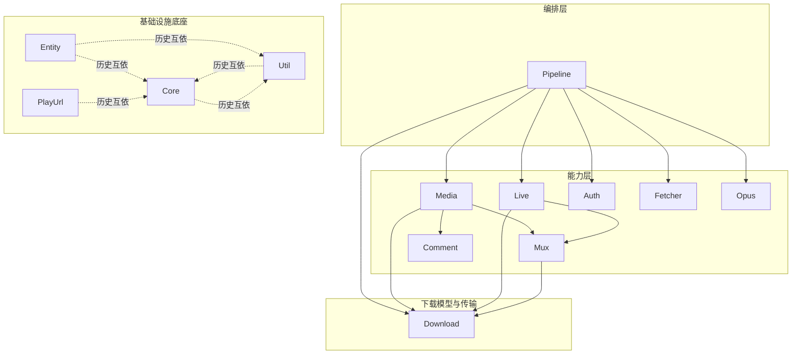

# BBDown.Core 依赖架构

本文档描述 `BBDown.Core` 内部命名空间的依赖关系与约束，供二次开发与重构时参考。依赖方向以源码中的 `using` 为准。

## 命名空间依赖图

## 分层职责

| 层 | 命名空间 | 职责 |
|---|---|---|
| 编排层 | `BBDown.Core.Pipeline` | 下载主干编排：参数准备（WorkSetup）、信息解析（VideoInfo）、分 P 调度（PageQueue）、输入解析（InputResolver） |
| 能力层 | `BBDown.Core.Media` | 分 P 下载流程：DASH / FLV / 页面资源 / 选轨 / 评论下载 |
| 能力层 | `BBDown.Core.Live` | 直播录制：录流、分段、混流、信号控制 |
| 能力层 | `BBDown.Core.Mux` | 混流：FFmpeg / MP4Box 参数构造与执行 |
| 能力层 | `BBDown.Core.Auth` | 登录与凭据存取 |
| 能力层 | `BBDown.Core.Fetcher` / `Opus` / `Comment` | 各类信息获取与专栏、评论渲染 |
| 下载模型与传输 | `BBDown.Core.Download` | 下载领域模型（DownloadRequest、RunConfig、WorkContext、PipelineSink 等）与传输实现（DownloadUtil、PartFile、CdnHost、BBDownAria2c） |
| 基础设施底座 | `BBDown.Core` / `Entity` / `Util` / `PlayUrl` | API 入口、实体、通用工具、播放地址解析 |

## 宿主集成点

Core 通过以下显式注入点向宿主（CLI / GUI）开放能力，宿主无需改动下载链路即可定制输出与交互：

| 注入点 | 说明 |
|---|---|
| `Logger.Output` | 日志输出目标。null 时写控制台（含颜色与 `BeforeWrite` 钩子）；GUI 等无控制台宿主替换为窗口日志区回调（参数为级别 + 完整渲染文本，需自行保证线程安全）。`BeforeWrite` 仅对默认控制台路径生效 |
| `Interaction.AskLine` / `AskIndex` | 交互式下载（逐集确认、手动选轨）的提问回调。默认读控制台；无控制台宿主返回 null 时按「不交互」回落处理 |
| `AppConfig.UserAgent` | 请求级 UA。`--user-agent` 由 `WorkSetup.ResolveConfig` 落入该字段，空串回落 `HTTPUtil.UserAgent` 进程级默认，并发任务互不覆盖 |

## 依赖约束

1. **依赖单向、无环**：下载域（Pipeline → Media/Live/Auth/Mux → Download → 底座）必须保持有向无环。新增代码禁止反向引用上层命名空间。
2. **禁止跨层引用**：能力层不得引用编排层（如 `Media` 不得 `using BBDown.Core.Pipeline`）；模型层不得引用能力层。
3. **底座互依为例外**：`Core` / `Entity` / `Util` / `PlayUrl` 之间的互相引用为既有事实（Logger、Config、HTTPUtil 等交织），新代码应尽量只依赖 `Core` 根，不再加深底座内部的耦合。
4. **外部程序执行统一走 `BBDown.Core.Util.Utils.RunExe`**，各能力层不得自建进程调用（原 `Muxer.RunExe` 已上提）。对外部进程的文件交换协议（`Download.PostProcessClient`）同样只依赖底座，不反向引用能力层。
5. **下载模型归位**：下载任务的入参/上下文/回调类型（DownloadRequest、RunConfig、FetchResult、WorkContext、PipelineSink、ToolPaths、LiveQuality、格式枚举）统一放在 `BBDown.Core.Download`，避免模型层反向引用能力层。

## 校验方式

新增或调整命名空间后，可通过分析全部 `.cs` 文件的 `using BBDown.Core.*` 生成依赖矩阵并做拓扑排序，确认下载域无环。
